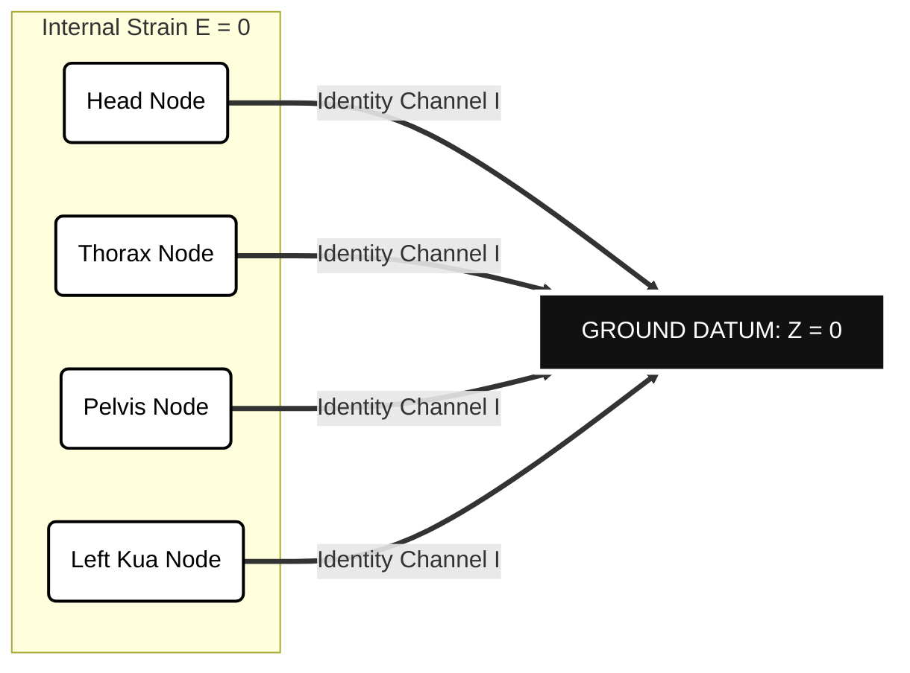

# floor state

- a bounded continuum bio-tensgrity structure resting on a Euclidean half space in an orthogonal 1g vector field.

```mermaid
graph LR
    %% Style Definitions
    classDef ground fill:#111,stroke:#fff,stroke-width:4px,color:#fff;
    classDef emptyNode fill:#fff,stroke:#000,stroke-width:2px,color:#000;

    %% Elements
    subgraph Body Continuum [Internal Strain E = 0]
        H(Head Node)
        T(Thorax Node)
        P(Pelvis Node)
        K(Left Kua Node)
    end

    G[GROUND DATUM: Z = 0]:::ground

    %% Identity Matrix Channels (Direct Load Dump)
    H ==>|Identity Channel I| G
    T ==>|Identity Channel I| G
    P ==>|Identity Channel I| G
    K ==>|Identity Channel I| G

    %% Apply empty node style
    class H,T,P,K emptyNode;
```