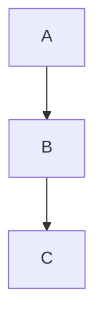

# Diagram Infrastructure Playbook

## Purpose

Document the diagram rendering pipeline: Mermaid → SVG, ASCII art → SVG, with export for review.

---

## Architecture

```
Content (*.md)
     │
     ├── ```mermaid ... ```  →  SVG (placeholder for now)
     │
     ├── ```              →  SVG (ASCII art converter)
     │   [diagram]          
     │   ```                 
     │
     └── dist/diagrams/ ← Exported for external review

Build output:
  dist/
  ├── index.html         (SVG embedded)
  ├── chapter-1.html     (SVG embedded)
  └── diagrams/
      ├── 01-riemannian-geometry-1-ascii.svg
      ├── floor-state-1-mermaid.svg
      └── ...
```

---

## Diagram Types

### 1. ASCII Art Diagrams

Converted to SVG at build time with proper typography.

```markdown
```
[Solid 3-Ball Cylinder] ──► Puncture at Origin ──► [Hollow Torus]
```
```

**Output:** Clean SVG with monospace font, matching column width.

### 2. Mermaid Diagrams

Currently rendered as SVG placeholders (server-side mermaid requires DOM).

```markdown

```

**Note:** For full Mermaid support, consider:
- Client-side rendering (add mermaid.js to template)
- Mermaid CLI in build pipeline
- External rendering tool

### 3. Custom Block Diagrams (:::figure)

For annotated figures with captions:

```markdown
:::figure:1.1:Coordinate transformation
ASCII or embedded content here
:::
```

---

## CSS Styling

Diagrams get automatic styling:

```css
.diagram {
  margin: 1.5em 0;
  padding: 1em;
  overflow-x: auto;
}

.mermaid-diagram svg {
  max-width: 100%;
  height: auto;
}

.ascii-diagram svg {
  border: 1px solid #ddd;
  background: #fafafa;
}

.diagram-error {
  background: #fee;
  border: 1px solid #c00;
}
```

---

## Review Workflow

1. **Build:** `just build --clean`
2. **Preview:** `just preview`
3. **Review embedded:** Open HTML in browser
4. **Review exported:** Open `dist/diagrams/` in design tool (Figma, Illustrator)
5. **Iterate:** Edit source, rebuild, repeat

---

## Adding New Diagrams

### ASCII Art

```markdown
```
[Input] ──► [Process] ──► [Output]
```
```

Use these characters for best results:
- `─►` for arrows
- `[ ]` for boxes
- `│` and `▼` for flow
- Unicode for subscripts/superscripts: `⁰¹²³⁴⁵⁶⁷⁸⁹`

### Mermaid

```markdown

```

Keep diagrams simple — hand-coded is fine.

---

## Future Enhancements

| Enhancement | Status | Notes |
|------------|--------|-------|
| Full Mermaid rendering | Deferred | Requires DOM or CLI |
| Syntax highlighting | Not needed | SVG is rasterized |
| Interactive diagrams | Future | Add client-side JS |
| Automated proof | Not planned | Visual review only |

---

## Related

- `playbooks/penrose-book-playbook.md` — Book formatting
- `playbooks/agent-infrastructure-playbook.md` — Build automation
- `src/agents/diagrams.ts` — Diagram processor source